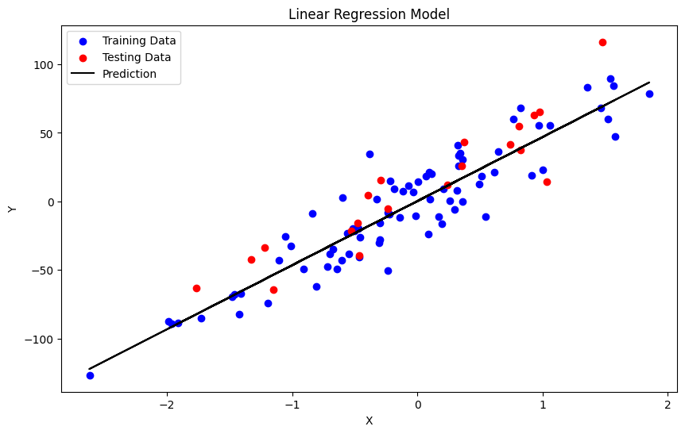

# Linear Regression from Scratch (NumPy)

This project implements Multiple Linear Regression using Numpy.
The model is trained using Batch Gradient Descent without relying on any machine learning frameworks.

The goal of this project is to better understand the inner workings of linear regression by building it step by step.



## Features

- Implements multiple linear regression from scratch
- Uses Batch Gradient Descent for optimization
- Includes a Jupyter Notebook (`test.ipynb`) for testing and visualization
- Compares the custom model with scikit-learn's Linear Regression
- Visualization of the learned regression line

## Dependencies

This project uses the following libraries:

- **NumPy** – used to implement the linear regression algorithm.
- **Scikit-learn** – used only for dataset generation and model comparison.
- **Matplotlib** – used for visualizing data and regression line.
- **Pandas** – optional tool for handling data.

**Note:** only **NumPy** is used to implement the algorithm.  
Other libraries are to help in dataset generation, testing, and visualization.

You can install them using:

```bash
pip install -r requirements.txt
```

## Installation

1. Clone the repository:
   ```bash
   git clone https://github.com/yousslessss/linear_regression_from_scratch
   ```
2. Go into the project directory:
   ```bash
   cd linear_regression_from_scratch
   ```
3. Install the dependencies:
   ```bash
   pip install -r requirements.txt
   ```

   ## Project Structure

```
linear_regression_from_scratch/
│
├── linear_regression.py   # Implementation of the regression algorithm
├── test.ipynb             # Notebook for testing and visualization
├── requirements.txt       # Project dependencies
└── README.md
```

## Usage

The `test.ipynb` notebook shows an example of how to use the `LinearRegression` class. It covers:

1.  **Data Generation**: Creating a synthetic dataset for regression.
2.  **Model Training**: Training the custom `LinearRegression` model and `scikit-learn`'s model.
3.  **Model Evaluation**: Comparing the performance of both models using Mean Squared Error and R² Score.
4.  **Visualization**: Plotting the data points and the regression line.

To run the notebook, you will need to have Jupyter Notebook or JupyterLab installed.

To explore the implementation and run examples:
   ```bash
   jupyter lab
   ```

## Quick Example
To use and test the model, you can import and train it as such:

```python
from linear_regression import LinearRegression

model = LinearRegression(learning_rate=0.01, n_iters=1000)
model.fit(X_train, y_train)

predictions = model.predict(X_test)
```

## Results

The model learns a linear relationship between input features and target value.
This relationship can be represented as:

y = w₁x₁ + w₂x₂ + ... + wₙxₙ + b

The parameters are updated using Batch Gradient Descent until the model fits the data.
it produces nearly identical results to scikit-learn's Linear Regression.

### Custom Model Performance:

Mean Squared Error: 416.809     
Root Mean Squared Error: 20.416     
Accuracy (R2): 0.802     


### Scikit-Learn Linear Regression:

Mean Squared Error: 416.809     
Root Mean Squared Error: 20.416     
Accuracy (R2): 0.802     

## Inspiration and Resources

This project was created as a foundational exercise to better understand how machine learning models work internally.

Linear regression shares several core ideas with more complex models such as neural networks, including weighted inputs, bias, and optimization using gradient descent. Implementing it from scratch helped build intuition about these concepts before moving on to more advanced algorithms.

This implementation was inspired by the following resources:

- **Linear Regression by Patrick Loeber**: https://www.youtube.com/watch?v=4swNt7PiamQ&list=PLqnslRFeH2Upcrywf-u2etjdxxkL8nl7E&index=22

- **Gradient Descent Cheatsheet**: https://ml-cheatsheet.readthedocs.io/en/latest/gradient_descent.html